<p align="center">
  
</p>

<p align="center">
  <a href="https://www.linkedin.com/in/daniel-totov"></a>
  <a href="mailto:danielacts@protonmail.com"></a>
  
</p>

<p align="center">
  <a href="https://wakatime.com/@c5073d47-3eae-491d-aad8-4b0ec95ad363.svg"></a>
</p>

## 🎭 The story in three acts

<!-- These are drafts in your voice. Rewrite any line that doesn't sound like you. -->

**Act I · The Stage.** Eight years as a professional theatrical actor. Performing night after night taught me discipline, timing, and working well in an ensemble where everyone depends on everyone else hitting their cue. At the end of those eight years I left the stage happy to have achieved some of my biggest dreams, such as playing on the stage of the National Theatre of Bulgaria 4 times, prizes won in festivals, and many character building plays behind my back.

**Act II · The Data.** Five years in data management at Pentagon Interactive, an international e-commerce company, that demanded my skills with English, French language, and SQL, keeping product data accurate for UK clients selling across European online marketplaces. That's where I saw how much depends on clean, consistent data.

**Act III · The Code.** Master's student in Software Engineering at Plovdiv University, building myself into a **Java backend developer**: the person who designs the systems that data lives in.

## 🎬 Now playing

- 🎓 **MSc Software Engineering & Technologies** at Plovdiv University "Paisii Hilendarski"
- 🇫🇷 **Erasmus+ semester at ESAIP, Angers** on the AI engineering track (fall 2026)
- ☕ **Going deeper into Java:** JDBC and the DAO pattern (HikariCP, MariaDB) with JPA next; generics; data structures built from scratch
- 📚 **On my desk:** *Effective Java* · *Clean Code* · *Head First Design Patterns* · *Spring in Action*
- 💼 **Looking for:** a junior Java backend role or internship where I can ship real features and learn from code review
<!-- - 🛠️ **Building:** [PROJECT-NAME](https://github.com/Theguyonthestage/REPO-NAME), a Java backend for managing marketplace product listings (JDBC → JPA → Spring Boot). Uncomment once the repo exists. -->

## 🧰 Toolkit

**Daily drivers**


**Databases:** SQL Server (T-SQL, SSMS) · MariaDB through JDBC + HikariCP

**Also worked with**


**Learning next**


## ⏱️ Rehearsal log

Theatre taught me that the work happens in rehearsal, not on opening night. WakaTime measures my real time in the editor, and a GitHub Action refreshes this every day:

<!--START_SECTION:waka-->

```txt
From: 06 September 2026 - To: 06 October 2026

Total Time: 10 hrs 39 mins

Java             7 hrs 53 mins         ██████████████████▓░░░░░░   74.03 %
XML              2 hrs 17 mins         █████▒░░░░░░░░░░░░░░░░░░░   21.52 %
Markdown         23 mins               █░░░░░░░░░░░░░░░░░░░░░░░░   03.62 %
TOML             3 mins                ░░░░░░░░░░░░░░░░░░░░░░░░░   00.49 %
Python           1 min                 ░░░░░░░░░░░░░░░░░░░░░░░░░   00.31 %
GitIgnore file   0 secs                ░░░░░░░░░░░░░░░░░░░░░░░░░   00.03 %
```

<!--END_SECTION:waka-->

## 📂 Featured work

| Project | What it shows |
|---|---|
| [**Java Masterclass challenges**](https://github.com/Theguyonthestage/java-masterclass-challenges) | Generics with bounded types, interfaces and polymorphism, plus a linked list and a binary search tree written from scratch, with no `Comparable` and no built-in collections |
| [**Burger ordering system**](https://github.com/Theguyonthestage/java-masterclass-challenges/tree/main/BillsBurgerChallenge) | Object-oriented design: inheritance and method overriding |
| [**University coursework**](https://github.com/Theguyonthestage/plovdiv-university-coursework) | Java exercises and exam tasks from my Master's programme |
<!-- | [**Bulgarian Theatres knowledge base**](https://github.com/Theguyonthestage/REPO-NAME) | 🎭 Where my two careers met: a Prolog knowledge-based system about Bulgarian theatres | -->
<!-- | [**Marketplace listings backend**](https://github.com/Theguyonthestage/REPO-NAME) | Java backend for product listings across EU marketplaces: JDBC → JPA → Spring Boot REST API | -->

## 🎟️ Curtain call

Hiring for a junior Java backend role, or want to talk code, data or theatre? Find me on [LinkedIn](https://www.linkedin.com/in/daniel-totov) or [send me an email](mailto:danielacts@protonmail.com).

<sub>And yes, the username is literal: for eight years I was the guy on the stage. 🎭</sub>
